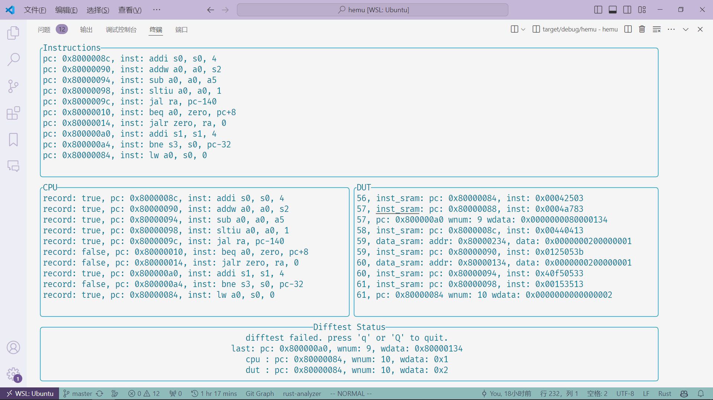

# HEMU 🚀 - A Rust Riscv Emulator

HEMU (HDU Emulator) is a RISCV64 processor simulator written in Rust. It draws inspiration from NEMU(NJU emulator)'s design philosophy and rewrites the logic of the processor using Rust, making the entire system more secure and efficient. Currently, it is an ISA-level simulator but has plans to expand into a cycle-level simulator in the future. At present, HEMU only supports the RISCV64IM instruction set architecture, but there are intentions to continue adding more instruction sets.

## Installation ⚙️

To install HEMU, you will need to have Rust installed on your machine. You can download and install Rust using the official installer from [rust-lang.org](https://www.rust-lang.org/tools/install).

Once Rust is installed, you can clone the HEMU repository from Github:

```sh
git clone --recurse-submodules https://github.com/Clo91eaf/hemu.git
```

or

```sh
git clone https://github.com/Clo91eaf/hemu.git
git submodule update --init --recursive
```

### Runing

To run HEMU, you can use the following command:

```sh
cargo run -- -k <path_to_binary>
```

Where `<path_to_binary>` is the path to the binary file that you want to run. For example:

```sh
cargo run -- -k ./dependencies/tests/bin/am-tests/add
```

#### Difftest

if you want to run difftest, you can use the following command:

```sh
cargo run -- -k ./dependencies/tests/bin/am-tests/add --diff
```

#### Difftest With Tui

if you want to run difftest with TUI, you can use the following command:

```sh
cargo run -- -k ./dependencies/tests/bin/am-tests/add --diff --tui
```

In Tui, you can press 'c' to continue, 's' to step, 'q' to quit.

#### Run opensbi

You should run HEMU first to generate the dtb with whatever binary. Then you can run HEMU with opensbi, you can use the following command:

```sh
# prepare the opensbi
git clone https://github.com/riscv-software-src/opensbi.git
# build the opensbi
cd opensbi
make PLATFORM=generic CROSS_COMPILE=riscv64-unknown-elf- FW_FDT_PATH=<path/to>/hemu/dependencies/opensbi/hemu.dtb
# run the opensbi
cp build/platform/generic/firmware/fw_payload.elf <path/to>/hemu
cd <path/to>/hemu
cargo run -- -k ./resources/opensbi.bin
```

### Testing

To test HEMU, you can use the following command:

```sh
cargo test --test <tests>
```

Where `<tests>` is the name of the test that you want to run. For example:

```sh
cargo test --test am-tests
```

## Why rust ❓

There are several potential benefits to using Rust to rewrite Nemus's logic:

1. **Memory safety**: Rust is designed to prevent memory-related bugs such as buffer overflows, null pointer dereferences, and use-after-free errors. By using Rust instead of C, the risk of these types of bugs is greatly reduced.

2. **Concurrency**: Rust has excellent support for concurrency, which means that HEMU could potentially support running multiple threads or processes simultaneously.

3. **Performance**: Rust is known for its performance, and code written in Rust can often be faster than equivalent code written in other languages. This could make HEMU faster than Nemus in some cases.

4. **Ecosystem**: Rust has a growing ecosystem of libraries and tools that can be used to develop HEMU. Taking advantage of this ecosystem could make development faster and easier.

5. **Maintainability**: Rust's syntax and features promote code that is easy to read, understand, and maintain. Writing HEMU in Rust may make it easier for future developers to modify and build upon the codebase.

## Progress 📈

- [x] RISCV64IM instruction set architecture
- [x] Pass am-tests
- [x] RISCV64IMAZicsr instruction set architecture
- [x] Pass riscv-tests
- [x] Add CI
- [x] Support for opensbi
- [x] Add TUI for debugging
- [x] Added support for peripherals.
- [x] Added interrupt handling mechanisms.
- [x] Added support for TLB (Translation Lookaside Buffer).
- [x] Simulated a bus.
- [ ] Support for Linux
- [ ] LA32 instruction set architecture
- [ ] MIPS32 instruction set architecture
- [ ] Designed a cycle-level processor.
- [ ] Simulated cache functionality.

- [ ] Add some emoji to make it look better.
- [ ] Write document.

## Contributing 🤝

Contributions to HEMU are welcome! If you find a bug or have a feature request, please open an issue on Github. If you would like to contribute code, you can make a fork of the repository and submit a pull request.

Before submitting a pull request, please ensure that your code adheres to the project's coding standards and passes all tests.

## License 📜

HEMU is released under the MIT license. See [LICENSE](https://github.com/username/HEMU/blob/master/LICENSE) for more information.
